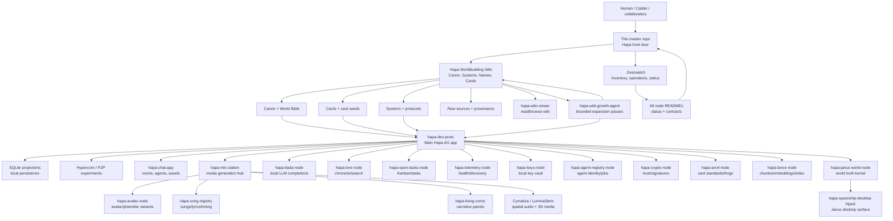

# Hapa

Hapa is a local-first AI/worldbuilding ecosystem: a canon wiki, a set of small cooperating nodes, creative media pipelines, card/agent systems, and operator tools for turning Calder's Hapa universe into usable software and living lore.

This repository is the front door. It does not replace the individual source repos or the Hapa Worldbuilding Wiki. It explains how the pieces fit together, where to start, and which node owns which responsibility.

Local workspace root assumptions in this guide:

- Master repo: `$HAPA_DESKTOP_ROOT/hapa`
- Canon/wiki vault: `$HAPA_DESKTOP_ROOT/Hapa_Worldbuilding_Wiki`
- Operations spine: `$HAPA_DESKTOP_ROOT/.Overwatch`
- Main app: `$HAPA_DESKTOP_ROOT/hapa-dev-proto`
- Media node: `$HAPA_MLX_STATION_ROOT`

## Hapa Ecosystem Context

<p>
  
</p>
<p>
  
  
</p>

Hapa is built as a constellation of modular nodes. Each node owns a focused capability, but participates in a shared protocol for provenance, handoff, cards, memory, and operations.

Every node is designed for both human operators and AI agents. The target contract is three surfaces: a UI for direct human review/control, an API for node-to-node and agent calls, and a CLI for scripted runs, audits, and handoffs. Individual repos may be at different maturity levels, but the public contract is that humans and agents can inspect, operate, and verify the node.

Hapa nodes power AI agents and avatar-agents that build new nodes and enhance existing ones. As work moves through the ecosystem, it is mined for utility, wisdom, and repeatable logic, then distilled into Hapa Cards: portable packets of skills, context, memories, and operational patterns.

Humans and AIs use Hapa Cards to discuss, ideate, prototype, and deploy increasingly complex workflows through a playable, card-collecting mechanic. Collaboration history, skills, work artifacts, and canonical decisions are stored in [hapa-second-brain](https://github.com/calderwong/hapa-second-brain), enriched into [Hapa Worldbuilding Wiki](https://github.com/calderwong/hapa-worldbuilding-wiki) entries, and converted back into cards. Avatar-agents can also be combined or specialized into purpose-built identities with their own storage, lore, canon, card decks, skills, and protocols.

## Start here

If you are new to Hapa, read in this order:

1. This README: the high-level map.
2. `AGENTS.md`: safe edit boundaries and verification gates for AI agents.
3. `docs/FEATURE_PARITY.md`: truthful API/CLI/UI parity status for this repo.
4. `docs/CLI.md` and `docs/API.md`: scriptable interface and local feature-spine contract.
5. `docs/NODE_MAP.md`: what each repo/node does and where it lives.
6. `docs/NODE_THUMBNAILS.md`: GitHub-rendered thumbnails for the published Hapa node repos.
7. `docs/WIKI_EXPANSION_MAP.md`: which wiki pages expand each concept.
8. `docs/OPERATING_MODEL.md`: how humans and agents should work safely in this ecosystem.
9. `docs/GITHUB_SECRET_SAFETY_AUDIT_2026-05-23.md`: latest local push-safety audit across Hapa git repositories.
10. `docs/KANBAN_UI_INGRESS_AUDIT.md`: current proof that node UIs link back to app-specific Overwatch Kanban boards.
11. The source README for the node you want to run or change.

Published GitHub entry points:

- [Hapa Worldbuilding Wiki](https://github.com/calderwong/hapa-worldbuilding-wiki) — source-package README and publication boundary.
- [Wiki node index](https://github.com/calderwong/hapa-worldbuilding-wiki/blob/main/Nodes/Index.md) — GitHub-published node index for the wiki package.
- [Wiki connectivity notes](https://github.com/calderwong/hapa-worldbuilding-wiki/blob/main/docs/HAPA_CONNECTIVITY.md) — published route map for adjacent Hapa nodes.
- [Wiki publication boundary](https://github.com/calderwong/hapa-worldbuilding-wiki/blob/main/docs/PUBLICATION_BOUNDARY.md) — what stays in GitHub versus the private vault.
- [Wiki path tokens](https://github.com/calderwong/hapa-worldbuilding-wiki/blob/main/docs/PATH_TOKENS.md) — portable path conventions for local/vault-backed wiki material.
- [Wiki vault collections](https://github.com/calderwong/hapa-worldbuilding-wiki/blob/main/docs/VAULT_COLLECTIONS.md) — manifest-backed collections outside the Git source package.
- [Overwatch Knowledgebase](https://github.com/calderwong/overwatch) — operations spine and source index.

## What Hapa is

Hapa has three layers that should stay connected:

1. Canon and memory
   - Markdown wiki pages for lore, names, timelines, systems, cards, raw sources, and development plans.
   - SQLite/Lance/projection stores that make the canon queryable by apps and agents.
   - Provenance pages that show where ideas came from.

2. Local nodes
   - Small services/apps with narrow responsibilities: main operator UI, media generation, LLM completions, task tracking, telemetry, keys, agent registry, card forging, world state, chat, songs, wiki growth, etc.
   - Nodes should be understandable independently, but they become useful when they exchange cards, events, media, status, and wiki references.

3. Creative/game surface
   - Cards, Phamiliars, Names, songs, living comics, Janus/spaceship surfaces, Cymatica spatial media, and future gameplay/economy loops.
   - These are not just assets; they are compressed memory packets that point back into lore, source material, and operational systems.

## Core idea

Hapa treats worldbuilding, software development, media creation, and agent work as one loop:

1. Raw source or lived idea enters the system.
2. Wiki/canon pages preserve context and provenance.
3. Cards and names compress the meaning into playable or reusable units.
4. Nodes expose capabilities: generation, search, registry, tasks, telemetry, identity, trust, world state.
5. Apps turn those capabilities into operator/player experiences.
6. Agents and humans inspect gaps, produce new artifacts, and write the results back into the wiki.

## Ecosystem flowchart

The same diagram is available as a dedicated Markdown page at `docs/FLOWCHART.md` and as a browser-viewable SVG/HTML artifact at `docs/assets/hapa-ecosystem-flowchart.html`.



## Related Hapa nodes

- [Hapa Worldbuilding Wiki](https://github.com/calderwong/hapa-worldbuilding-wiki) — Canon, systems, names, cards, and node provenance referenced by the front-door repo.
- [Overwatch](https://github.com/calderwong/overwatch) — Operational inventory, source index, protocols, task inbox, and runbook companion.
- [Hapa AG / Dev Proto](https://github.com/calderwong/hapa-dev-proto-private) — Primary local-first app that consumes cards, wiki context, assets, and node services.
- [Hapa Space](https://github.com/calderwong/hapa-space) — Unity fleet visualization of the repo/node ecosystem described here.
- [Hapa Telemetry Node](https://github.com/calderwong/hapa-telemetry-node) — Runtime health and discovery layer for the nodes cataloged by this repo.

## Node thumbnail gallery

The full GitHub-rendered visual index is in [`docs/NODE_THUMBNAILS.md`](docs/NODE_THUMBNAILS.md). It covers all 40 published Hapa node repositories with repo-local thumbnails copied from existing Hapa site demo stills, Second Brain generated node heroes, or clearly labeled representative screenshots.

<p>
  <a href="docs/NODE_THUMBNAILS.md"></a>
  <a href="docs/NODE_THUMBNAILS.md"></a>
  <a href="docs/NODE_THUMBNAILS.md"></a>
  <a href="docs/NODE_THUMBNAILS.md"></a>
  <a href="docs/NODE_THUMBNAILS.md"></a>
  <a href="docs/NODE_THUMBNAILS.md"></a>
  <a href="docs/NODE_THUMBNAILS.md"></a>
  <a href="docs/NODE_THUMBNAILS.md"></a>
</p>

## The major node families

### 1. Front door, operations, and canon

- [hapa](.) — this repository. The human/agent onboarding hub.
- [.Overwatch](https://github.com/calderwong/overwatch) — operations spine: inventories, status board, task inbox, reports, and cross-agent protocols.
- [Hapa Worldbuilding Wiki](https://github.com/calderwong/hapa-worldbuilding-wiki) — canonical Markdown knowledge graph for lore, systems, cards, names, raw sources, and development synthesis.
- [hapa-wiki-viewer](https://github.com/calderwong/hapa-wiki-viewer) — UI for browsing the wiki as a local app instead of raw folders.
- [hapa-wiki-growth-agent](https://github.com/calderwong/hapa-wiki-growth-agent) — bounded local-agent workflow that expands the wiki with draft articles, lore dispatches, card drafts, media hooks, and ledgers.

### 2. Primary app and interaction surfaces

- [hapa-dev-proto](https://github.com/calderwong/hapa-dev-proto-private) — main Hapa AG Electron/React app; operator UI, card library, wormhole/workspace flows, SQLite projections, and P2P experiments.
- [hapa-chat-app](https://github.com/calderwong/hapa-chat-app) — local chat/workroom app for rooms, participants, agent visits, assets, worker jobs, and conversation inspection.
- [hapa-spaceship-desktop-hijack](https://github.com/calderwong/hapa-spaceship-desktop-hijack) — Janus/spaceship desktop surface prototype.
- [hapa-living-comic](https://github.com/calderwong/hapa-living-comic) — native living comic viewer/editor for story panels and media-backed narrative presentation.

### 3. AI, media, music, and creative generation

- [hapa-mlx-station](https://github.com/calderwong/hapa-mlx-station/blob/main/README.md) — Apple Silicon media-generation station and authenticated hub for local image/media jobs.
- [hapa-llada-node](https://github.com/calderwong/hapa-llada-node) — local LLM/completion node for sovereign LLaDA/MLX experiments.
- [hapa-avatar-node](https://github.com/calderwong/hapa-avatar-node) — avatar/phamiliar lineage generation and metadata prototype.
- [hapa-song-registry](https://github.com/calderwong/hapa-song-registry) — songs, Suno/imported audio, lyrics, prompts, timing analysis, and music metadata.
- [hapa-luminastem-station](https://github.com/calderwong/hapa-luminastem-station) — LuminaStem/3D/audio stem visualization prototype.
- [Cymatica](https://github.com/calderwong/cymatica) — SwiftPM/RealityKit spatial audio and stems-to-3D experimentation.

### 4. Reliability, coordination, and trust

- [hapa-telemetry-node](https://github.com/calderwong/hapa-telemetry-node) — health, metrics, launcher, node registry, and discovery hub.
- [hapa-open-tasks-node](https://github.com/calderwong/hapa-open-tasks-node) — Hapa operational Kanban/task node.
- [hapa-lore-node](https://github.com/calderwong/hapa-lore-node) — chronicle/search node for daily progress, wisdom, and canon/operator history.
- [hapa-keys-node](https://github.com/calderwong/hapa-keys-node) — local key vault for node/provider secrets.
- [hapa-agent-registry-node](https://github.com/calderwong/hapa-agent-registry-node) — agent profiles, avatar jobs, identity/onboarding metadata.
- [hapa-crypto-node](https://github.com/calderwong/hapa-crypto-node) — Swift-native encryption, signatures, identity proofs, and trust primitives.

### 5. Cards, indexes, protocol, and world state

- [hapa-anvil-node](https://github.com/calderwong/hapa-anvil-node) — card standardization, evaluation, forging, and artifact emission.
- [hapa-lance-node](https://github.com/calderwong/hapa-lance-node) — projection/index layer for cards, wiki chunks, embeddings, and multimodal records.
- [hapa-janus-world-node](https://github.com/calderwong/hapa-janus-world-node) — Janus local world truth kernel: append-only world events and derived snapshots.
- [Consul Node Proto](https://github.com/calderwong/consul-node-proto) — Warden/Heap/River proof harness and environment-up verification prototype.
- [hapa-cultivation-suite](https://github.com/calderwong/hapa-cultivation-suite) — Pulse/cultivation protocol tooling monorepo.
- [hapa-spec-scaffold](https://github.com/calderwong/hapa-spec-scaffold) — compact protocol/spec/test scaffold.

### 6. Archives, capsules, and historical references

- [hapa-og](https://github.com/calderwong/hapa-og) — older integrated Hapa app snapshot for archaeology/reference.
- [Help Fund Hapa Capsule](https://github.com/calderwong/capsule) — funding/simulator capsule UI artifact.

## Where to expand in the wiki

The full canon/wiki routes are local and vault-backed. The GitHub source package intentionally publishes only the small source boundary, node index, policy docs, and vault manifests. Use these published entry points from GitHub:

- [Hapa Worldbuilding Wiki](https://github.com/calderwong/hapa-worldbuilding-wiki) — source-package README for canon, node, and vault orientation.
- [Nodes/Index](https://github.com/calderwong/hapa-worldbuilding-wiki/blob/main/Nodes/Index.md) — GitHub-published node index.
- [Nodes/Existing/Hapa Worldbuilding Wiki](https://github.com/calderwong/hapa-worldbuilding-wiki/blob/main/Nodes/Existing/Hapa%20Worldbuilding%20Wiki.md) — node note for the wiki package itself.
- [docs/HAPA_CONNECTIVITY.md](https://github.com/calderwong/hapa-worldbuilding-wiki/blob/main/docs/HAPA_CONNECTIVITY.md) — ecosystem links and publication gate notes.
- [docs/PUBLICATION_BOUNDARY.md](https://github.com/calderwong/hapa-worldbuilding-wiki/blob/main/docs/PUBLICATION_BOUNDARY.md) — Git/vault boundary for local canon pages, generated corpora, DBs, and media.
- [manifests/wiki-vault-collections.json](https://github.com/calderwong/hapa-worldbuilding-wiki/blob/main/manifests/wiki-vault-collections.json) — machine-readable pointer to vault-backed wiki collections.

For local operators, deeper canon routes such as Canon, Cards, Systems, Names, Development, and Operations live under `$HAPA_WIKI_ROOT` / `$HAPA_VAULT_ROOT`, not as direct GitHub blob links.

See `docs/WIKI_EXPANSION_MAP.md` for a longer routing table.

## How to use this repository

For a human collaborator:

1. Read the high-level model above.
2. Open the wiki intro pages to understand the fiction/canon frame.
3. Open `docs/NODE_MAP.md` to pick the node relevant to your task.
4. Read that node's README before changing anything.
5. If you learn something durable, write it back to the wiki or Overwatch, not only into chat.

For an AI agent:

1. Treat this repo as the front door, not the source of truth for every detail.
2. Check `.Overwatch` for current operational status.
3. Check the target node README and git status before editing.
4. Preserve local-first assumptions and provenance links.
5. Avoid canonizing speculative output directly into `Canon/` without explicit instruction; use draft/development/ledger areas when uncertain.

For development work:

1. Start with the owning node repo.
2. Use the node README to understand purpose, inputs, outputs, interfaces, related nodes, and operating contract.
3. Keep changes scoped.
4. Verify behavior locally.
5. Commit in the owning repo and, when the ecosystem map changes, update this master repo and `.Overwatch`.

## Interfaces and standards status

This repo is an active local Node Space/front-door app, but it is not the owning source repo for every Hapa node. Its local feature spine lives in `electron/hapa-local.js` and is exposed through:

- UI: `npm run desktop` opens the Electron Node Space; `site/index.html` is the static front-door site.
- CLI: `npm run cli -- help`, `npm run cli -- health`, and `npm run cli -- capabilities`.
- API: Electron IPC, the local CommonJS module, and an optional read-only loopback HTTP API are available. Start HTTP with `npm run api -- --port 8876`.

Truth status: partial compliance with the Hapa Node App Standard. The audit CLI gap is healed by `bin/hapa-node-space.js`, and the first read-only HTTP API is available, but full compliance still requires a persistent service manifest and a first-class Docs/README panel inside the Node Space Electron shell. See `docs/FEATURE_PARITY.md`, `docs/CLI.md`, and `docs/API.md`.

Verification:

```bash
cd $HAPA_DESKTOP_ROOT/hapa
npm run check
npm run smoke:cli
npm run smoke:desktop
```

## Website

A designed static front-door site now lives at:

- `site/index.html`

It introduces Hapa's why/what/how, wiki, lore, node ecosystem, cards, development progress, and next phases for both human readers and AI agents. Open it directly in a browser or serve it locally:

```bash
cd $HAPA_DESKTOP_ROOT/hapa/site
python3 -m http.server 8765 --bind 127.0.0.1
open http://127.0.0.1:8765/index.html
```

## Repository contents

- `README.md` — front-door introduction and high-level flowchart.
- `AGENTS.md` — AI-agent operating context, safe edit boundaries, and verification gates.
- `site/` — designed static Hapa website for humans and AI agents.
- `electron/` — Electron desktop wrapper and local feature spine for Hapa Node Space.
- `bin/hapa-node-space.js` — minimal scriptable CLI for health, capabilities, context, nodes, music, ships, services, and flow-explainer dry runs/writes.
- `docs/FEATURE_PARITY.md` — truthful API/CLI/UI parity matrix and remaining standards gaps.
- `docs/API.md` — local module/Electron IPC API contract and future HTTP shape.
- `docs/CLI.md` — CLI command reference.
- `docs/NODE_MAP.md` — thorough list of source repos/nodes with paths, roles, and ecosystem meaning.
- `docs/WIKI_EXPANSION_MAP.md` — routes from concepts to wiki pages.
- `docs/OPERATING_MODEL.md` — conventions for humans/agents working in Hapa.
- `docs/FLOWCHART.md` — Mermaid flowcharts for the ecosystem, onboarding, and card/media loop.
- `docs/PROCESS_FLOW_CARDS.md` — multi-node action scripts for teachable Hapa process cards.
- `docs/NODE_SPACE_DESKTOP.md` — Electron/local version of Node Space with wiki, song, node, filesystem, and protocol bridge.
- `docs/MAKE_FLOW_AND_EXPLAINER_PROTOCOL.md` — standard for turning multi-node flows into protocol records, explainers, and flow cards.
- `docs/assets/hapa-ecosystem-flowchart.html` — standalone browser-viewable diagram.

## Status

This repo is an onboarding and coordination hub. It intentionally contains documentation and maps, not the implementation code for every node.

Created from the local Hapa workspace inventory and the 2026-05-22 README quality pass across the Hapa source repos.
