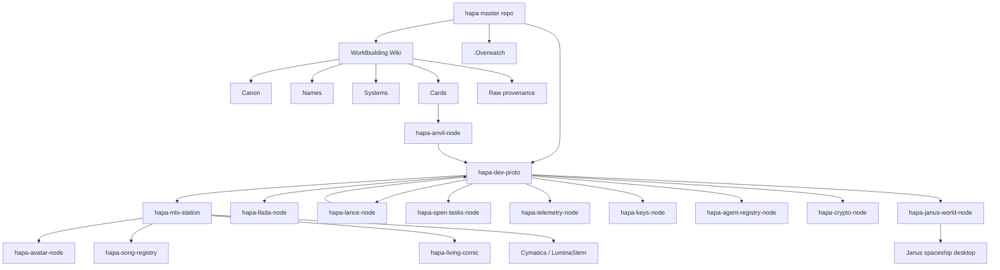
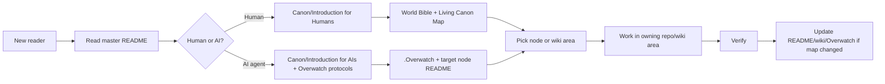
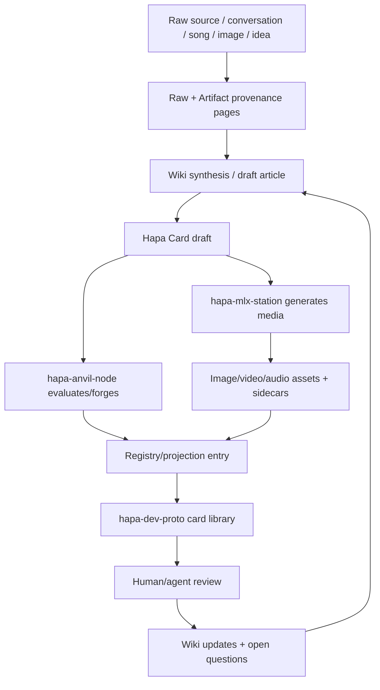
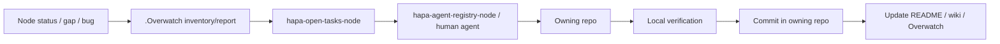

# Hapa Flowcharts

## Ecosystem overview

```mermaid
flowchart TB
  master[hapa master repo] --> wiki[Worldbuilding Wiki]
  master --> overwatch[.Overwatch]
  master --> app[hapa-dev-proto]

  wiki --> canon[Canon]
  wiki --> names[Names]
  wiki --> systems[Systems]
  wiki --> cards[Cards]
  wiki --> raw[Raw provenance]

  app --> media[hapa-mlx-station]
  app --> llm[hapa-llada-node]
  app --> search[hapa-lance-node]
  app --> tasks[hapa-open-tasks-node]
  app --> telemetry[hapa-telemetry-node]
  app --> keys[hapa-keys-node]
  app --> agents[hapa-agent-registry-node]
  app --> crypto[hapa-crypto-node]
  app --> world[hapa-janus-world-node]

  media --> avatar[hapa-avatar-node]
  media --> songs[hapa-song-registry]
  media --> comic[hapa-living-comic]
  media --> cymatica[Cymatica / LuminaStem]

  cards --> forge[hapa-anvil-node]
  forge --> app
  search --> app
  world --> spaceship[Janus spaceship desktop]
```

## Onboarding path

```mermaid
flowchart LR
  start[New reader] --> readme[Read master README]
  readme --> human{Human or AI?}
  human -->|Human| intro[Canon/Introduction for Humans]
  human -->|AI agent| ai[Canon/Introduction for AIs + Overwatch protocols]
  intro --> wiki[World Bible + Living Canon Map]
  ai --> ops[.Overwatch + target node README]
  wiki --> nodepick[Pick node or wiki area]
  ops --> nodepick
  nodepick --> work[Work in owning repo/wiki area]
  work --> verify[Verify]
  verify --> update[Update README/wiki/Overwatch if map changed]
```

## Card/media loop

```mermaid
flowchart TB
  source[Raw source / conversation / song / image / idea] --> provenance[Raw + Artifact provenance pages]
  provenance --> synthesis[Wiki synthesis / draft article]
  synthesis --> card[Hapa Card draft]
  card --> anvil[hapa-anvil-node evaluates/forges]
  card --> media[hapa-mlx-station generates media]
  media --> assets[Image/video/audio assets + sidecars]
  anvil --> registry[Registry/projection entry]
  assets --> registry
  registry --> app[hapa-dev-proto card library]
  app --> feedback[Human/agent review]
  feedback --> wiki[Wiki updates + open questions]
  wiki --> synthesis
```

## Operations loop

```mermaid
flowchart LR
  status[Node status / gap / bug] --> overwatch[.Overwatch inventory/report]
  overwatch --> tasks[hapa-open-tasks-node]
  tasks --> agent[hapa-agent-registry-node / human agent]
  agent --> repo[Owning repo]
  repo --> verify[Local verification]
  verify --> commit[Commit in owning repo]
  commit --> report[Update README / wiki / Overwatch]
```
