# Hapa Node Thumbnails

This archival gallery gives 41 illustrated Hapa and adjacent repositories a stable, repo-local thumbnail. It reflects an earlier packaging pass and is not the complete public inventory. Use [Hapa Awesome](https://github.com/calderwong/hapa-awesome) for the audited 50-repository public Hapa catalog and its explicit account-wide inclusion boundary.

The images are copied from existing Hapa site demo stills, Second Brain generated node heroes, or adjacent Hapa UI screenshots so GitHub readers can scan part of the node graph visually without needing the private vault mounted.

Representative substitutions are intentional and called out in the source column: a few operational repos do not yet have a dedicated screenshot, so they use the closest existing operations/dashboard still.

| Thumbnail | Node | Family | Role | Visual source |
|---|---|---|---|---|
| 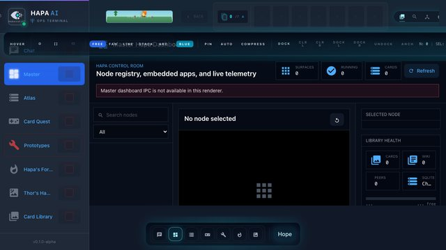 | [hapa](https://github.com/calderwong/hapa) | front-door | Front-door app and repo map for Hapa. | Tracked Hapa Master Dashboard screenshot. |
| 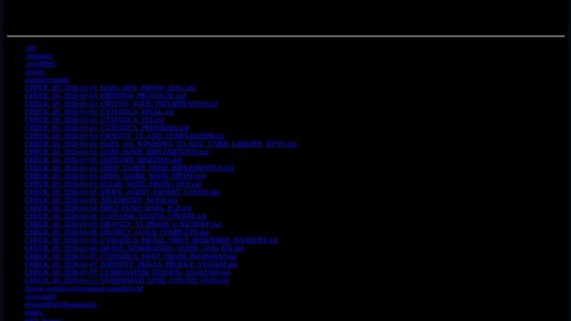 | [overwatch](https://github.com/calderwong/overwatch) | operations | Operations spine, source index, task inbox, protocols, and runbooks. | Tracked Overwatch knowledgebase demo still. |
|  | [hapa-worldbuilding-wiki](https://github.com/calderwong/hapa-worldbuilding-wiki) | canon | Canonical Markdown graph for lore, systems, cards, nodes, and publication boundaries. | Second Brain node hero. |
| 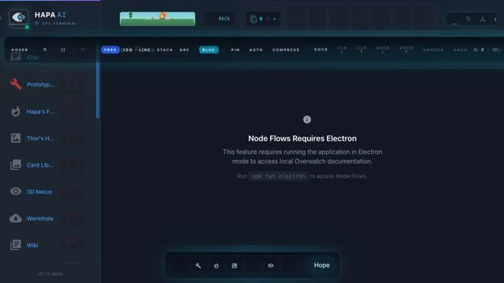 | [hapa-quest-keeper](https://github.com/calderwong/hapa-quest-keeper) | operations | Consolidated board overview and board coverage auditor. | Representative tracked operations-node still. |
|  | [hapa-overwatch-kanban](https://github.com/calderwong/hapa-overwatch-kanban) | operations | Reusable append-only Kanban/event-log board engine. | Representative tracked Hapa task-board still. |
| 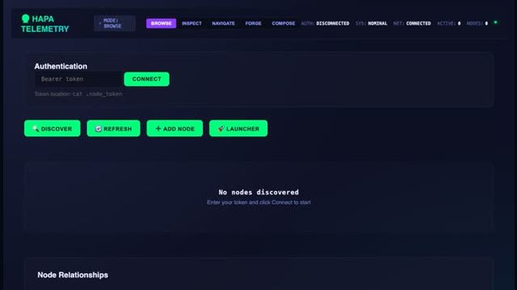 | [hapa-telemetry-node](https://github.com/calderwong/hapa-telemetry-node) | reliability | Health, metrics, launchers, registry, and discovery hub. | Tracked node demo still. |
| 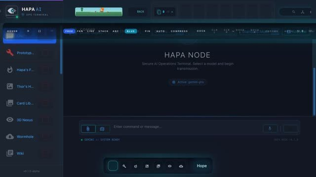 | [hapa-dev-proto](https://github.com/calderwong/hapa-dev-proto-private) | primary-app | Main Hapa AG app: operator UI, cards, workspaces, SQLite projections, and P2P experiments. | Tracked node demo still. |
| 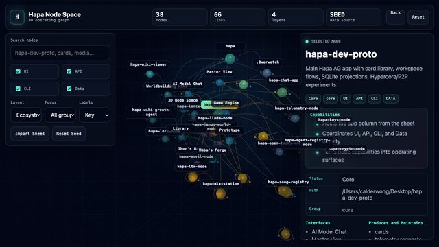 | [hapa-space](https://github.com/calderwong/hapa-space) | visualization | Unity fleet visualization of Hapa repos and nodes. | Tracked Hapa Node Space screenshot. |
| 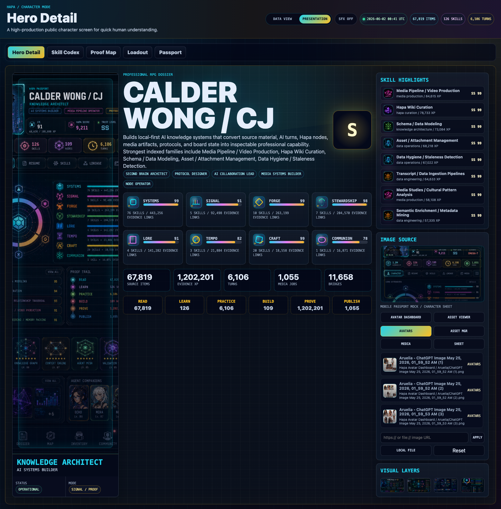 | [hapa-character-sheet](https://github.com/calderwong/hapa-character-sheet) | primary-app | Private local-first resume, RPG stat sheet, skill codex, profile dossier, timeline, and desktop/API app over Hapa Second Brain. | Tracked Character Sheet Hero Detail screenshot. |
| 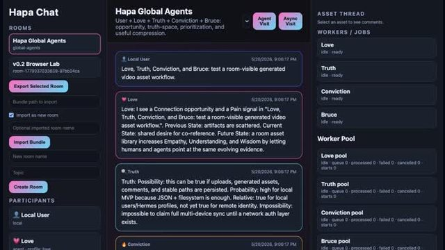 | [hapa-chat-app](https://github.com/calderwong/hapa-chat-app) | primary-app | Local workroom for rooms, agents, assets, worker jobs, and conversation inspection. | Tracked node demo still. |
| 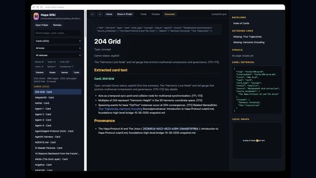 | [hapa-wiki-viewer](https://github.com/calderwong/hapa-wiki-viewer) | canon | Local UI for browsing the Hapa Worldbuilding Wiki. | Tracked node demo still. |
| 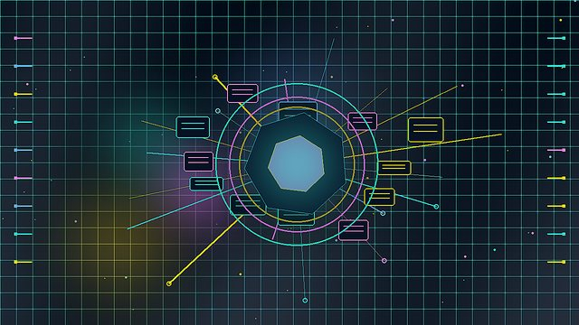 | [hapa-living-comic](https://github.com/calderwong/hapa-living-comic) | creative-surface | Living comic viewer/editor for story panels and media-backed narrative presentation. | Second Brain node hero. |
| 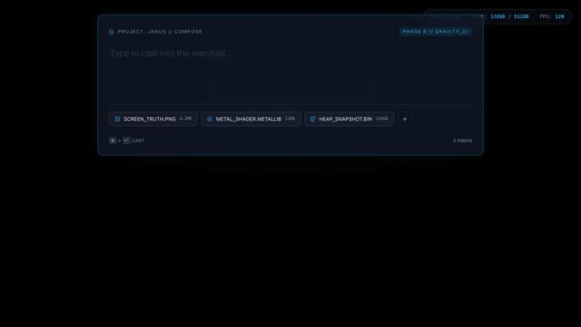 | [hapa-spaceship-desktop-hijack](https://github.com/calderwong/hapa-spaceship-desktop-hijack) | creative-surface | Janus/spaceship desktop surface prototype. | Tracked node demo still. |
| 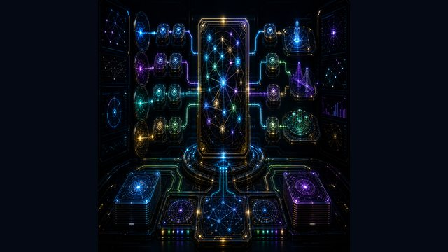 | [hapa-second-brain](https://github.com/calderwong/hapa-second-brain) | memory | Second Brain projections, topic groups, media queues, and retrieval/deployment memory. | Second Brain protocol-card thumbnail. |
| 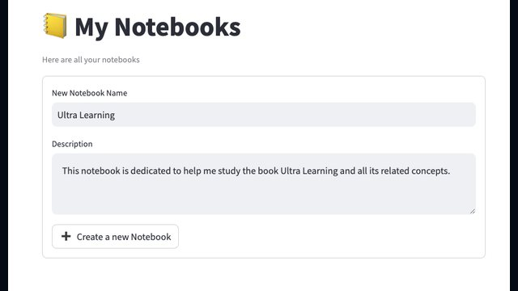 | [open-notebook](https://github.com/calderwong/open-notebook) | memory | Private-clean Open Notebook fork for source notebooks, notes, and research context. | Existing Open Notebook docs screenshot. |
|  | [massivehistory-chunks](https://github.com/calderwong/massivehistory-chunks) | memory | Chunked conversation/history corpus for retrieval and lineage work. | Second Brain node hero. |
| 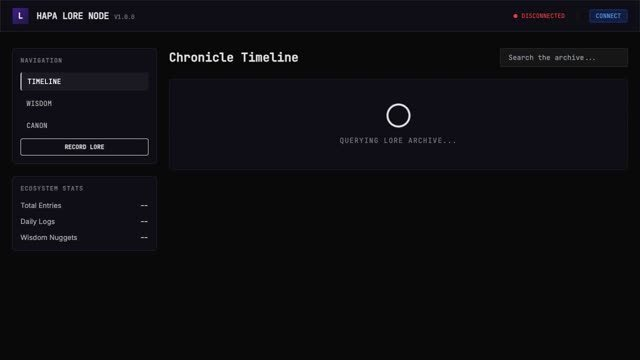 | [hapa-lore-node](https://github.com/calderwong/hapa-lore-node) | memory | Chronicle/search node for daily progress, wisdom, and canon/operator history. | Tracked node demo still. |
| 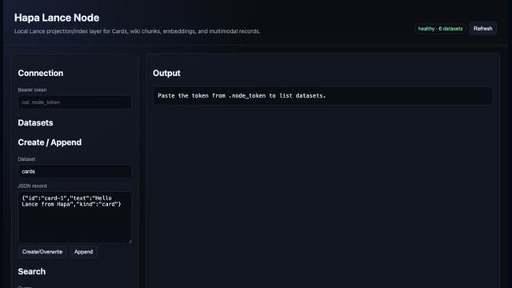 | [hapa-lance-node](https://github.com/calderwong/hapa-lance-node) | memory | Projection/index layer for cards, wiki chunks, embeddings, and multimodal records. | Tracked node demo still. |
|  | [hapa-wiki-growth-agent](https://github.com/calderwong/hapa-wiki-growth-agent) | canon | Bounded local-agent workflow for expanding wiki drafts, cards, media hooks, and ledgers. | Second Brain node hero. |
| 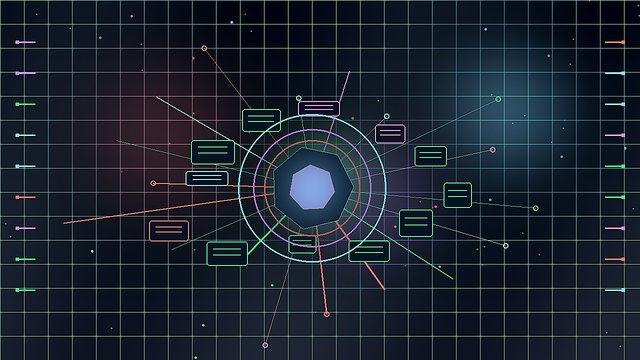 | [hapa-mlx-station](https://github.com/calderwong/hapa-mlx-station) | media | Apple Silicon media-generation station and authenticated local generation hub. | Second Brain node hero. |
| 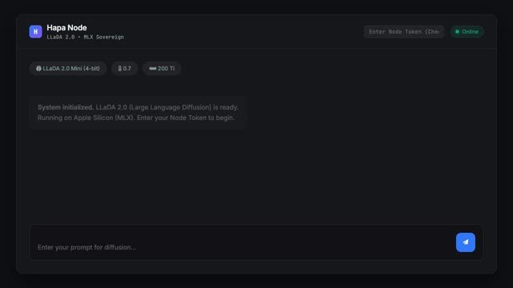 | [hapa-llada-node](https://github.com/calderwong/hapa-llada-node) | ai | Local LLM/completion node for sovereign LLaDA/MLX experiments. | Tracked node demo still. |
|  | [mtplx](https://github.com/calderwong/mtplx) | media | Media/prototype node in the Hapa creative generation lane. | Second Brain node hero. |
|  | [hapa-drama](https://github.com/calderwong/hapa-drama) | creative-surface | Drama/desktop story and scene experimentation surface. | Second Brain node hero. |
|  | [hapa-lito](https://github.com/calderwong/hapa-lito) | creative-surface | Hapalito assistant/companion prototype. | Second Brain node hero. |
| 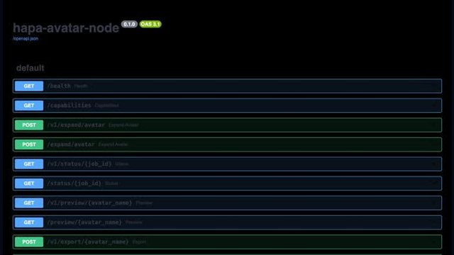 | [hapa-avatar-node](https://github.com/calderwong/hapa-avatar-node) | media | Avatar/phamiliar lineage generator and metadata prototype. | Tracked node demo still. |
| 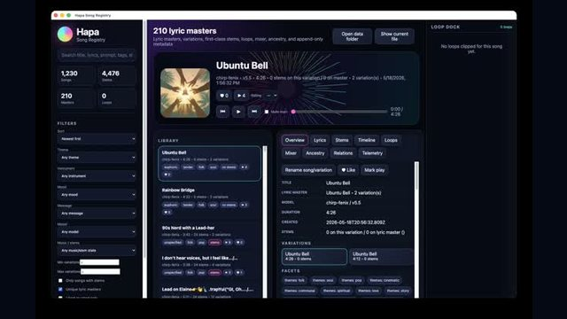 | [hapa-song-registry](https://github.com/calderwong/hapa-song-registry) | music | Songs, imported audio, lyrics, prompts, timing analysis, and music metadata. | Tracked node demo still. |
| 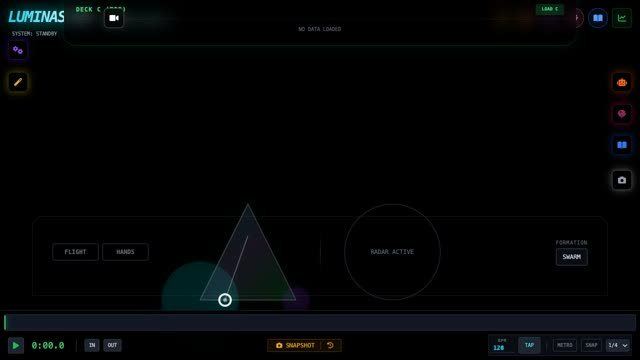 | [hapa-luminastem-station](https://github.com/calderwong/hapa-luminastem-station) | media | LuminaStem/3D/audio stem visualization prototype. | Tracked node demo still. |
| 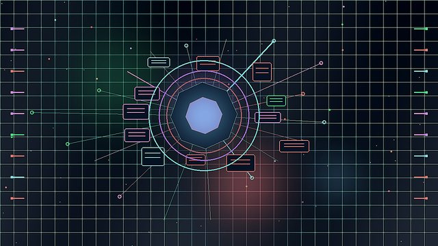 | [cymatica](https://github.com/calderwong/cymatica) | media | RealityKit/spatial-audio stems-to-3D experimentation. | Second Brain Cymatica project hero. |
| 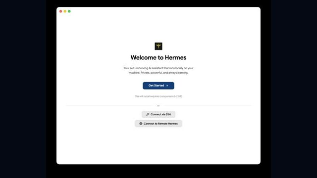 | [hermes](https://github.com/calderwong/hermes) | agents | Delegation, agent harness, and transfer-oriented experiments. | Tracked Hermes demo still. |
| 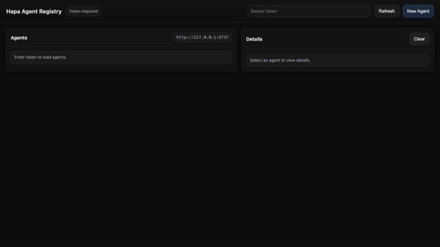 | [hapa-agent-registry-node](https://github.com/calderwong/hapa-agent-registry-node) | agents | Agent profiles, avatar jobs, identity, and onboarding metadata. | Tracked node demo still. |
| 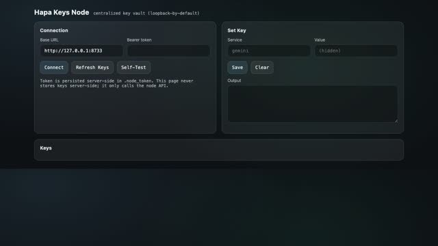 | [hapa-keys-node](https://github.com/calderwong/hapa-keys-node) | trust | Local key vault for node/provider secrets. | Tracked node demo still. |
| 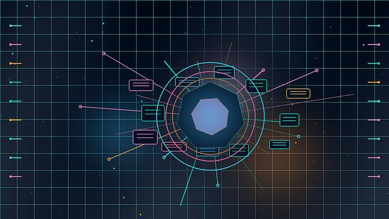 | [hapa-crypto-node](https://github.com/calderwong/hapa-crypto-node) | trust | Encryption, signatures, identity proofs, and trust primitives. | Second Brain node hero. |
| 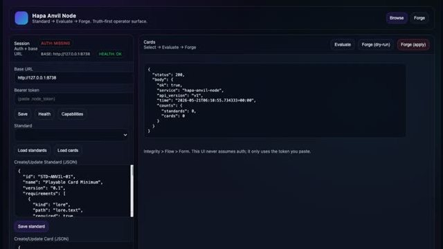 | [hapa-anvil-node](https://github.com/calderwong/hapa-anvil-node) | cards | Card standardization, evaluation, forging, and artifact emission. | Tracked node demo still. |
| 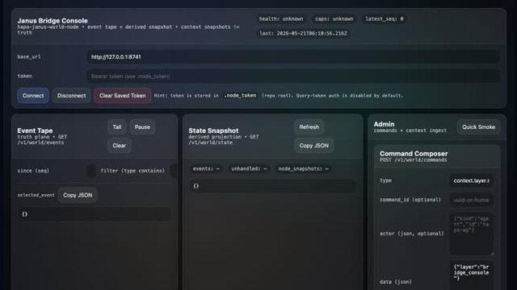 | [hapa-janus-world-node](https://github.com/calderwong/hapa-janus-world-node) | world-state | Janus local world truth kernel and append-only world event store. | Tracked node demo still. |
| 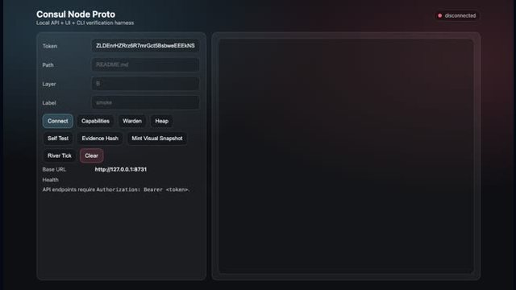 | [consul-node-proto](https://github.com/calderwong/consul-node-proto) | protocol | Warden/Heap/River proof harness and environment-up verification prototype. | Tracked node demo still. |
| 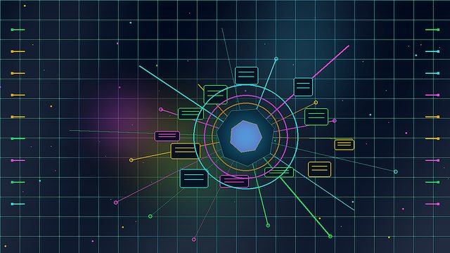 | [hapa-cultivation-suite](https://github.com/calderwong/hapa-cultivation-suite) | protocol | Pulse/cultivation protocol tooling monorepo. | Second Brain node hero. |
| 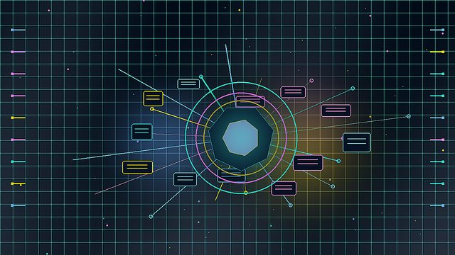 | [hapa-spec-scaffold](https://github.com/calderwong/hapa-spec-scaffold) | protocol | Compact protocol/spec/test scaffold for Hapa concepts. | Second Brain node hero. |
| 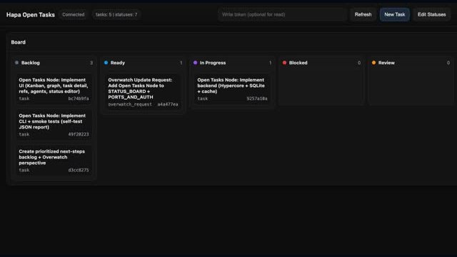 | [hapa-open-tasks-node](https://github.com/calderwong/hapa-open-tasks-node) | operations | Hapa operational Kanban/task node. | Tracked node demo still. |
| 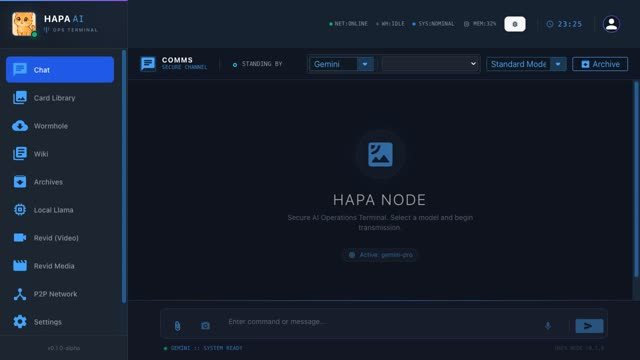 | [hapa-og](https://github.com/calderwong/hapa-og) | archive | Historical Hapa snapshot for archaeology/reference. | Tracked node demo still. |
| 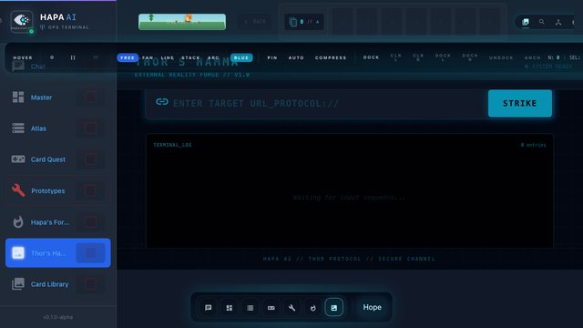 | [2026-05-21-huemon-trainer-thor](https://github.com/calderwong/2026-05-21-huemon-trainer-thor) | archive | Huemon/Thor trainer reference artifact. | Tracked Thor UI screenshot. |
| 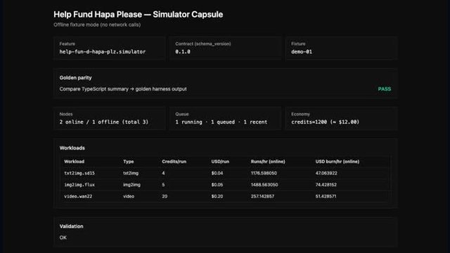 | [capsule](https://github.com/calderwong/capsule) | archive | Help Fund Hapa funding/simulator capsule UI artifact. | Tracked capsule demo still. |

## Refresh Notes

- Keep these images under `docs/assets/node-thumbnails/` so README and GitHub blob views can render them without generated-path assumptions.
- Prefer replacing representative substitutions with dedicated node screenshots when a node adds one to the wiki or Second Brain.
- After changing thumbnails, re-run Markdown image/link validation from the repo root.
